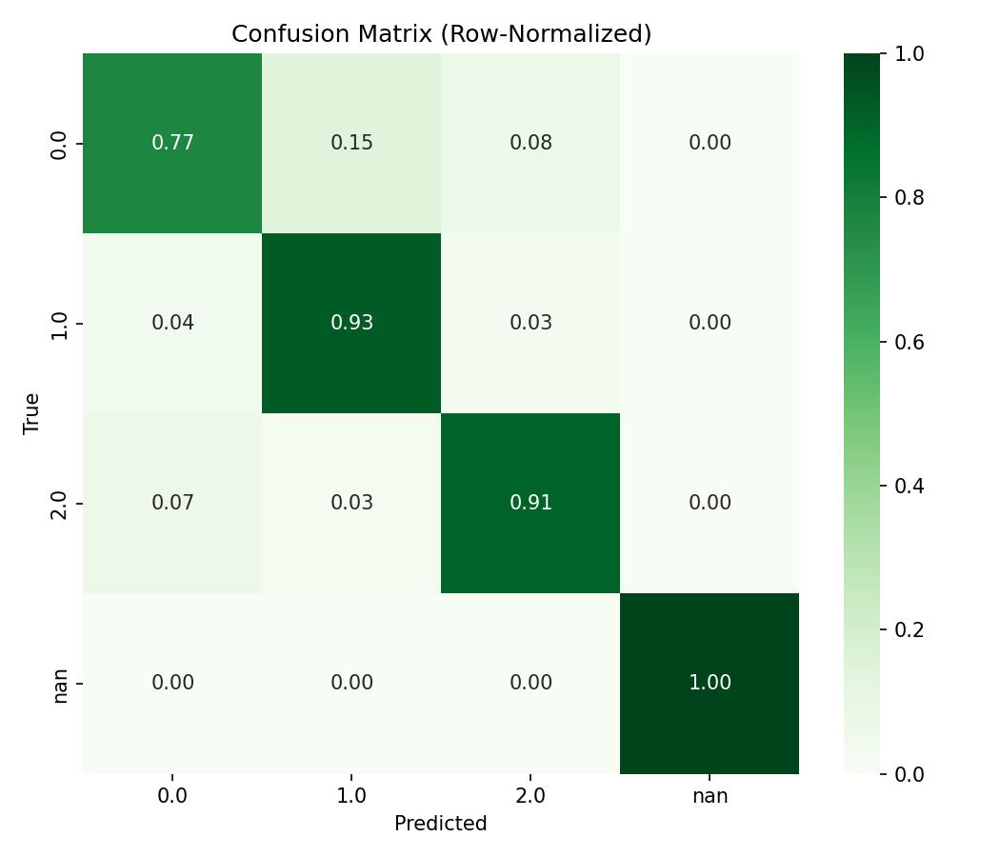

🧘‍♂️ MindBreath – AI-Powered Stress & Breathing Coach (Prediction Module)

This repository provides a full ML pipeline for MindBreath, an intelligent assistant that detects stress from short journal entries (and optionally biometric or typing data) and recommends breathing exercises.
This document covers the Prediction module, which allows you to use the trained artifacts (.h5, .pkl, .yaml, .json) to classify new entries or datasets.

📦 Artifacts

After training (train_mindbreath.py), you should have the following files in:

C:\Users\sagni\Downloads\Mind Breath\

mindbreath_model.h5 → Trained Keras model (weights + architecture)

mindbreath_preprocess.pkl → Preprocessing pipeline + label encoder

mindbreath_model.json → Model config (JSON)

mindbreath_model.yaml → Model config (YAML)

training_history.csv, accuracy.png, loss.png → (optional) training logs and plots

🚀 Predictor Script

The script predict_mindbreath.py supports:

CSV Input: run predictions on a new dataset (same schema as training).

Single Text Input: predict stress level from one sentence/journal entry.

Jupyter / Notebook Mode: import helper functions directly.

🛠️ Requirements

Python 3.10+

TensorFlow / Keras

scikit-learn

pandas, numpy

matplotlib, seaborn (optional, for plotting)

joblib, PyYAML

Install with:

pip install tensorflow scikit-learn pandas numpy matplotlib seaborn joblib pyyaml

⚡ Usage
1. Predict from CSV
python predict_mindbreath.py --in "C:\Users\sagni\Downloads\Mind Breath\archive\new_entries.csv" \
                             --out "C:\Users\sagni\Downloads\Mind Breath\predictions_mindbreath.csv" \
                             --print

--in → input CSV (must contain the same columns used in training, missing ones are auto-filled)

--out → optional output CSV path (defaults to predictions_mindbreath.csv in the same folder)

--print → print top predictions to console

2. Predict from Single Text
python predict_mindbreath.py --text "Feeling overwhelmed after long study sessions" --print

Works if your training data had text features (journals, notes, etc.).

Predictor will drop the sentence into the first text column (or create one if none existed).

3. Jupyter Notebook Mode

The script auto-detects Jupyter and strips injected arguments (-f …json).
You can also import helpers directly:

from predict_mindbreath import predict_csv, predict_text

# Predict from CSV
predict_csv(r"C:\Users\sagni\Downloads\Mind Breath\archive\new_entries.csv",
            save_to=r"C:\Users\sagni\Downloads\Mind Breath\predictions_mindbreath.csv",
            show=True)

# Predict from single text
predict_text("I feel calm after breathing practice", show=True)

📊 Output

CSV Predictions → adds pred_label and probability columns (prob_*).

Console Table (with --print or show=True):

pred_label   prob_neg   prob_pos
     stress      0.23       0.77
     calm        0.85       0.15

Works for binary or multiclass stress labels.

🧠 How It Works

Reloads your saved preprocess.pkl (numeric, categorical, text, datetime handling).

Feeds aligned features into the trained Keras model.

Outputs label + probability distribution per entry.

Supports both Terminal CLI and Jupyter interactive usage.

🔍 Troubleshooting

Error: missing columns → The script auto-adds defaults (0, "unknown", "", or current timestamp`). Check your input schema if predictions look wrong.

Can't get attribute 'DateTimeExpand' → Make sure you use the provided predict_mindbreath.py which redeclares custom classes before unpickling.

Provide either --text or --in → Run with one of the two options. If you run without, the script will ask interactively.

📁 Suggested Repo Structure
MindBreath/
│── train_mindbreath.py
│── evaluate_mindbreath.py
│── predict_mindbreath.py
│── archive/
│   ├── Stress_Dataset.csv
│   └── StressLevelDataset.csv
│── outputs/
│   ├── mindbreath_model.h5
│   ├── mindbreath_preprocess.pkl
│   ├── mindbreath_model.json
│   ├── mindbreath_model.yaml
│   ├── training_history.csv
│   ├── accuracy.png
│   ├── loss.png
│   ├── confusion_matrix.png
│   ├── confusion_matrix_norm.png
│   ├── classification_report.txt
│   └── predictions_mindbreath.csv
└── README.md
Author
SAGNIK PATRA
